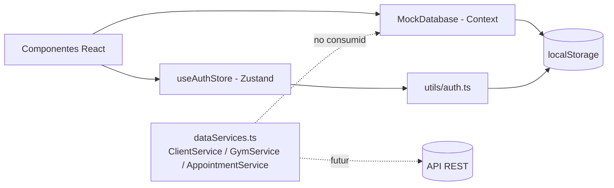
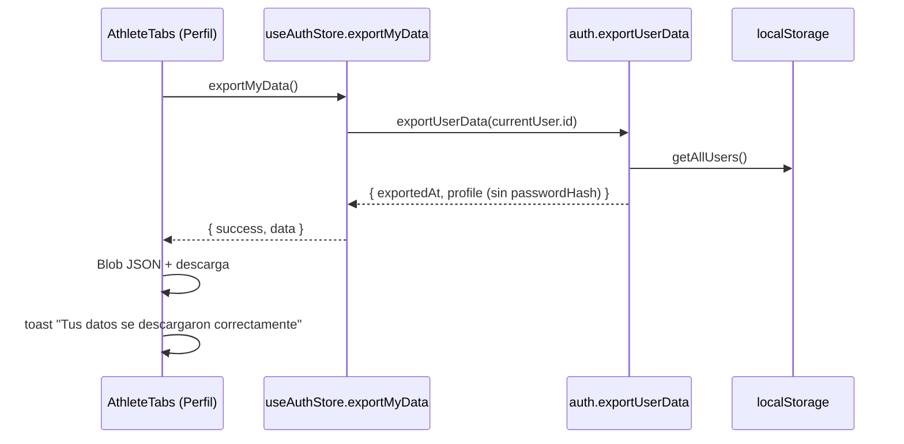

# Servicios y Capa de Datos — Expert Sports Planner

Este documento describe cómo accede la aplicación a los datos, cómo se gestionan errores y cómo se ejecutan las mutaciones críticas de negocio.

> **Estado actual (importante):** la aplicación **no realiza llamadas de red reales**. No hay `axios` ni interceptores, y la persistencia es 100 % cliente (`localStorage`). Existe un cliente HTTP basado en `fetch` ([src/services/dataServices.ts](../src/services/dataServices.ts)) preparado para una futura API, pero hoy está en modo _mock_ y **ningún componente lo consume**. Los flujos reales están en [src/utils/auth.ts](../src/utils/auth.ts), [src/store/useAuthStore.ts](../src/store/useAuthStore.ts) y [src/context/MockDatabase.tsx](../src/context/MockDatabase.tsx).

## Índice

1. [Arquitectura de datos](#1-arquitectura-de-datos)
2. [Configuración base](#2-configuración-base)
3. [Estructura de servicios](#3-estructura-de-servicios)
4. [Manejo de errores](#4-manejo-de-errores)
5. [Flujos de datos específicos](#5-flujos-de-datos-específicos)
6. [Brechas conocidas y recomendaciones](#6-brechas-conocidas-y-recomendaciones)

---

## 1. Arquitectura de datos



| Capa                              | Archivo                                                     | Responsabilidad                                                              |
| --------------------------------- | ----------------------------------------------------------- | ---------------------------------------------------------------------------- |
| Persistencia de usuarios y sesión | [utils/auth.ts](../src/utils/auth.ts)                       | CRUD de usuarios, hashing, sesión en `localStorage` (`users`, `currentUser`) |
| Estado de autenticación           | [store/useAuthStore.ts](../src/store/useAuthStore.ts)       | Acciones de sesión/perfil que devuelven `{ success, error }`                 |
| Fachada React                     | [context/AuthContext.tsx](../src/context/AuthContext.tsx)   | Expone el store y helpers de rol (`isTrainer()`, etc.)                       |
| Datos de dominio                  | [context/MockDatabase.tsx](../src/context/MockDatabase.tsx) | Clientes, planes, citas, reservas y solicitudes atleta–entrenador            |
| Servicios (preparados para API)   | [services/dataServices.ts](../src/services/dataServices.ts) | Control de rol + cliente HTTP futuro                                         |
| Estado asíncrono genérico         | [hooks/useAsync.ts](../src/hooks/useAsync.ts)               | `status`, `data`, `error`, `execute`                                         |

---

## 2. Configuración base

Definida en `API_CONFIG` ([dataServices.ts](../src/services/dataServices.ts)):

| Parámetro  | Valor                                                             | Notas                                                                            |
| ---------- | ----------------------------------------------------------------- | -------------------------------------------------------------------------------- |
| `BASE_URL` | `import.meta.env.VITE_API_BASE_URL` o `http://localhost:3000/api` | Variable de entorno de Vite                                                      |
| `TIMEOUT`  | `30000` (ms)                                                      | Se almacena en `ApiClient` pero **no se aplica** (no hay `AbortController`)      |
| `USE_MOCK` | `true` (valor fijo en código)                                     | Cambiar manualmente a `false` para usar la API. **No** se lee de `VITE_USE_MOCK` |

### 2.1 `ApiClient`

Clase interna (no exportada) con métodos `get`, `post`, `put`, `delete` sobre un único `request(endpoint, options)`:

- Construye la URL: `${baseUrl}${endpoint}`.
- Cabeceras: `Content-Type: application/json` + cabeceras de autenticación + las del llamador.
- Si `useMock` es `true`, `request` lanza `"Mock mode - use MockDatabase context"`.
- Respuesta no `ok` → `throw new Error("HTTP {status}: {statusText}")`.
- Registra el fallo con `console.error` y relanza el error.

### 2.2 Autenticación y tokens

- `getAuthHeaders()` añade `Authorization: Bearer <token>` si `getCurrentSession()` devuelve un objeto con `token`.
- `getCurrentSession` es un alias de `getCurrentUser` ([auth.ts](../src/utils/auth.ts)), que lee `currentUser` de `localStorage`.
- **Hoy no existe token**: el login ([`loginUser`](../src/utils/auth.ts)) compara un hash SHA-256 local y guarda el objeto `User` sin `token`, por lo que el encabezado nunca se envía.
- **Interceptores:** no existen. No hay refresco de token, reintentos ni manejo global de `401/403`. El comentario del store menciona a los interceptores como uso futuro.

### 2.3 Variables de entorno relacionadas

| Variable                                                          | Uso                                                               |
| ----------------------------------------------------------------- | ----------------------------------------------------------------- |
| `VITE_API_BASE_URL`                                               | URL base de la API futura                                         |
| `VITE_ADMIN_EMAIL`, `VITE_ADMIN_PASSWORD_HASH`, `VITE_ADMIN_NAME` | Semilla del super administrador ([auth.ts](../src/utils/auth.ts)) |

---

## 3. Estructura de servicios

Las clases se instancian con `createServices(mockDb)`:

```ts
export const createServices = (mockDb) => ({
  clientService: new ClientService(mockDb),
  gymService: new GymService(mockDb),
  appointmentService: new AppointmentService(mockDb),
});
```

En modo mock delegan en `MockDatabase`; en modo API llaman a `apiClient`. Cada método valida el rol de la sesión antes de actuar y lanza `Error("Unauthorized: ...")` si no corresponde.

### 3.1 `ClientService`

| Método                                             | Rol                                    | Endpoint (modo API)                  |
| -------------------------------------------------- | -------------------------------------- | ------------------------------------ |
| `getClients()`                                     | Entrenador: todos; Atleta: los propios | `GET /clients`                       |
| `getPendingClients()`                              | Entrenador                             | `GET /clients?status=pending`        |
| `getCompletedClients()`                            | Entrenador                             | `GET /clients?status=completed`      |
| `getActivePlans()`                                 | Atleta                                 | `GET /plans/active`                  |
| `addClientRequest(data)`                           | Atleta                                 | `POST /clients`                      |
| `updateClientPlan(clientId, planText, planObject)` | Entrenador                             | `PUT /clients/{id}/plan`             |
| `toggleSessionCompletion(clientId, week, day)`     | Atleta                                 | `POST /clients/{id}/sessions/toggle` |
| `updateSessionNote(clientId, week, day, note)`     | Atleta                                 | `PUT /clients/{id}/sessions/note`    |

### 3.2 `GymService`

| Método                           | Rol        | Endpoint                       |
| -------------------------------- | ---------- | ------------------------------ |
| `getGymSchedule(date)`           | Todos      | `GET /gym/schedule?date=`      |
| `updateGymSchedule(date, slots)` | Entrenador | `PUT /gym/schedule`            |
| `bookGymSlot(date, slotId)`      | Atleta     | `POST /gym/bookings`           |
| `cancelGymBooking(bookingId)`    | Atleta     | `DELETE /gym/bookings/{id}`    |
| `getAthleteGymBookings()`        | Atleta     | `GET /gym/bookings?athleteId=` |
| `getAllGymBookings()`            | Entrenador | `GET /gym/bookings`            |

### 3.3 `AppointmentService`

| Método                                       | Rol        | Endpoint                               |
| -------------------------------------------- | ---------- | -------------------------------------- |
| `addAppointment(data)`                       | Atleta     | `POST /appointments`                   |
| `getAthleteAppointments()`                   | Atleta     | `GET /appointments?athleteId=`         |
| `getTrainerAppointments(date)`               | Entrenador | `GET /appointments?date=`              |
| `updateAppointmentStatus(id, status)`        | Entrenador | `PUT /appointments/{id}`               |
| `getAppointmentAvailability(date)`           | Todos      | `GET /appointments/availability?date=` |
| `updateAppointmentAvailability(date, slots)` | Entrenador | `PUT /appointments/availability`       |

### 3.4 Servicios efectivamente en uso (hoy)

No existen `authService`, `athleteService` ni `medicalService`; su equivalente real son funciones y acciones:

| Dominio                                    | Implementación real                                                                                     |
| ------------------------------------------ | ------------------------------------------------------------------------------------------------------- |
| Autenticación                              | `useAuthStore` → `loginUser`, `registerUser`, `logoutUser`                                              |
| Perfil y seguridad                         | `useAuthStore` → `updateProfile`, `changeUserPassword`, `exportMyData`, `deleteMyAccount`               |
| Datos del atleta (datos básicos, lesiones) | `updateAthleteBasicInfo`, `setAthleteInjuries` en [auth.ts](../src/utils/auth.ts)                       |
| Vinculación atleta–entrenador              | `sendTrainerRequest`, `acceptTrainerRequest`, `rejectTrainerRequest`, `removeAthlete` en `MockDatabase` |

Las rutas de la API futura están especificadas en [API_MIGRATION.md](./API_MIGRATION.md).

### 3.5 Hook `useAsync`

[`useAsync(fn, immediate)`](../src/hooks/useAsync.ts) devuelve `execute`, `status` (`idle | pending | success | error`), `data`, `error` y booleanos `isIdle/isPending/isSuccess/isError`. **Relanza** el error tras registrarlo, por lo que el llamador debe capturarlo. Actualmente no está adoptado por los componentes.

---

## 4. Manejo de errores

### 4.1 Convenciones

| Origen                                 | Mecanismo                                                                                 | Resultado                                   |
| -------------------------------------- | ----------------------------------------------------------------------------------------- | ------------------------------------------- |
| Acciones de `useAuthStore`             | `try/catch` interno; devuelven `{ success: false, error }` y guardan `error` en el estado | El componente decide qué mostrar            |
| Funciones de `auth.ts`                 | `throw new Error("mensaje en español")`                                                   | Capturadas por el store o por el componente |
| `MockDatabase` (solicitudes, reservas) | Devuelven `{ success: false, message }` (no lanzan)                                       | El componente muestra `result.message`      |
| Servicios (`dataServices.ts`)          | `throw new Error("Unauthorized: ...")` y `HTTP {status}: ...`                             | Sin consumo actual                          |
| `ApiClient.request`                    | `console.error` + relanza                                                                 | Sin interceptor global                      |

### 4.2 Presentación al usuario

- **Toasts** (`useToast().addToast(message, type)`): canal estándar para éxitos (`success`), errores (`error`), validaciones (`warning`) e información (`info`). Patrón habitual:

  ```tsx
  const result = await updateProfile({ avatarId });
  if (result.success) addToast("Avatar actualizado", "success");
  else addToast(result.error || "No se pudo guardar", "error");
  ```

- **Modales de confirmación** (`ConfirmDialog`): solo para acciones destructivas (quitar atleta, eliminar cuenta), no para mostrar errores.
- **Mensajes de validación en línea** para formularios (p. ej. `hasAthleteEditErrors` en `CoachDashboard`).
- Mensajes de usuario en español; usar un texto genérico (`"No se pudo guardar"`) cuando el error no tenga mensaje.

### 4.3 Reglas recomendadas

1. Nunca mostrar el error técnico crudo (`HTTP 500: ...`) al usuario; mapearlo a un mensaje amigable.
2. Un `finally` debe liberar los estados de carga (`saving`, `deleting`, `loading`).
3. No usar `alert()`/`confirm()`.
4. Al migrar a API, centralizar el mapeo de códigos HTTP en `ApiClient` (p. ej. `401` → cerrar sesión, `403` → toast "No tienes permisos", `>=500` → "Error del servidor").

---

## 5. Flujos de datos específicos

### 5.1 Exportar datos del usuario

**No hay endpoint**; la exportación se genera en el cliente.



- Solo exporta el perfil del **propio usuario** autenticado (usa `currentUser.id`, nunca un id recibido).
- Excluye siempre `passwordHash`.
- Errores: usuario no autenticado o `"Usuario no encontrado"` → toast `"No se pudieron exportar los datos"`.
- Equivalente API propuesto: `GET /me/export` (mismo contenido; `Content-Disposition: attachment`).

### 5.2 Asignación de lesiones por el Entrenador (restringido por rol)

Función: `setAthleteInjuries(athleteId, injuries)` ([auth.ts](../src/utils/auth.ts)).

Flujo en `CoachDashboard` → "Mis Atletas" → modal "Datos Básicos y Lesiones":

1. El entrenador abre el modal; `injuriesDraft` se carga con `liveAthlete.injuries`.
2. Edita la lista (añadir, cambiar `status` `ACTIVE`/`RECOVERED`, eliminar).
3. Al pulsar **Guardar** (deshabilitado si `hasAthleteEditErrors`):
   - `updateAthleteBasicInfo(editingAthleteId, {...})`
   - `setAthleteInjuries(editingAthleteId, injuriesDraft.filter(i => i.description.trim()))` — **reemplaza la lista completa** y descarta entradas vacías.
4. Éxito: toast `"Datos del atleta actualizados"`; error: toast con `err.message` o `"No se pudieron guardar los datos del atleta"`.

Restricción de rol (estado actual):

| Nivel   | Estado                                                                                                                                          |
| ------- | ----------------------------------------------------------------------------------------------------------------------------------------------- |
| UI      | Solo `CoachDashboard` importa y llama a `setAthleteInjuries`; `AthleteTabs` muestra las lesiones en solo lectura                                |
| Función | **No valida rol ni vínculo**: acepta cualquier `athleteId` y no comprueba que quien llama sea un `TRAINER` ni que el atleta esté vinculado a él |

> Con `localStorage` la restricción es solo de interfaz: cualquiera con acceso a la consola puede modificar datos. Es una limitación del modo mock.

Equivalente API propuesto:

```http
PUT /athletes/{athleteId}/injuries
Authorization: Bearer <token>
Content-Type: application/json

{ "injuries": [ { "id": "…", "description": "…", "date": "2026-09-01", "status": "ACTIVE" } ] }
```

| Código | Significado                                                    |
| ------ | -------------------------------------------------------------- |
| `200`  | Lista reemplazada                                              |
| `401`  | Sin sesión                                                     |
| `403`  | El llamador no es `TRAINER` o el atleta no está vinculado a él |
| `404`  | Atleta inexistente                                             |
| `422`  | Datos inválidos                                                |

### 5.3 Desvinculación (Entrenador → Atleta → Empresa)

**No existe una operación "Entrenador → Empresa"** ni una de empresa propiamente. La única desvinculación implementada es **Entrenador quita a un Atleta**, y la salida de la empresa es una consecuencia derivada (los datos de empresa del atleta se obtienen en vivo del entrenador vinculado; ver [BUSINESS_LOGIC.md](./BUSINESS_LOGIC.md)). Tampoco existe hoy una acción para que el atleta se desvincule por sí mismo.

Flujo:

1. `CoachDashboard` guarda el atleta en `athleteToRemove` y abre `ConfirmDialog` (`variant="danger"`, texto: _"Podrá volver a enviarte una solicitud más adelante"_).
2. Al confirmar, `handleRemoveAthlete(athleteId)` invoca `removeAthlete(trainerId, athleteId)` de `MockDatabase`.
3. `removeAthlete` cambia la solicitud `ACCEPTED` entre ambos a `REMOVED` (con `removedAt`); no borra el registro.
4. Se muestra el toast `"Atleta removido"` (`info`); `getAthleteTrainer` deja de devolver entrenador, por lo que el atleta pierde el entrenador y la empresa heredada.

Estados de la solicitud: `PENDING → ACCEPTED → REMOVED` (o `REJECTED`). Tras `REMOVED`, `sendTrainerRequest` permite una nueva solicitud porque solo bloquea `PENDING` y `ACCEPTED`.

Equivalente API propuesto:

```http
DELETE /trainers/me/athletes/{athleteId}
Authorization: Bearer <token>
```

| Código | Significado                               |
| ------ | ----------------------------------------- |
| `204`  | Vínculo finalizado (estado `REMOVED`)     |
| `403`  | El llamador no es el entrenador vinculado |
| `404`  | Vínculo inexistente                       |

El backend debe derivar la empresa del atleta a partir del vínculo activo (sin copiar datos de empresa al atleta) para mantener la cascada.

---

## 6. Brechas conocidas y recomendaciones

| #   | Hallazgo                                                                                               | Recomendación                                                  |
| --- | ------------------------------------------------------------------------------------------------------ | -------------------------------------------------------------- |
| 1   | `dataServices.ts` no se usa en ningún componente                                                       | Adoptarlo gradualmente o retirarlo para evitar duplicidad      |
| 2   | `USE_MOCK` está fijo en `true`; `VITE_USE_MOCK` no existe (ver [API_MIGRATION.md](./API_MIGRATION.md)) | Derivarlo de `import.meta.env` al activar la API               |
| 3   | Los servicios usan `session.userId`, pero la sesión es un `User` con `id`                              | Corregir a `session.id` antes de activar la API                |
| 4   | `USER_ROLES.COACH` (`"TRAINER"`) y `ROLES.TRAINER` coexisten                                           | Unificar en `ROLES`                                            |
| 5   | La sesión no tiene `token`; `TIMEOUT` no se aplica                                                     | Incorporar token real y `AbortController` al migrar            |
| 6   | `setAthleteInjuries`, `updateAthleteBasicInfo` y `removeAthlete` no validan rol ni vínculo             | Validar en servicio/backend (`403`)                            |
| 7   | `removeAthlete` no devuelve resultado ni error                                                         | Devolver `{ success, message }` como `sendTrainerRequest`      |
| 8   | No hay interceptor global de errores                                                                   | Centralizar mapeo HTTP → mensajes y acciones (logout en `401`) |
