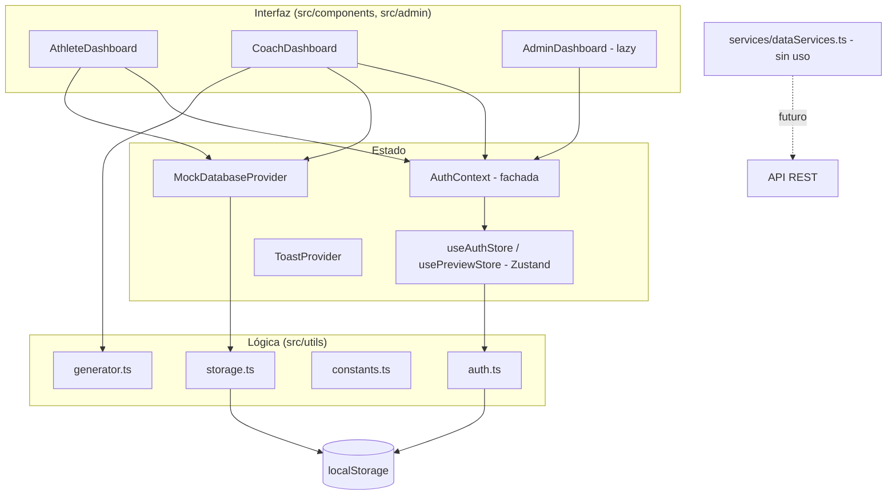
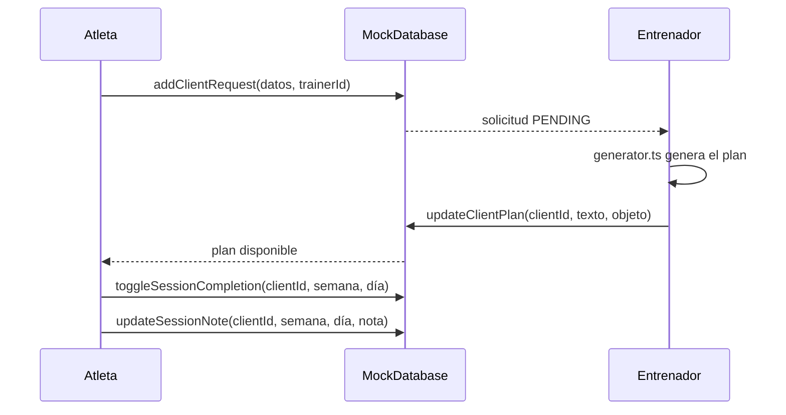

# Arquitectura

Visión general de la estructura técnica de **Expert Sports Planner**. Este documento no duplica el detalle de otros temas: cada sección enlaza al documento que lo desarrolla.

## Índice

1. [Resumen](#1-resumen)
2. [Diagrama de alto nivel](#2-diagrama-de-alto-nivel)
3. [Estructura de carpetas](#3-estructura-de-carpetas)
4. [Capas](#4-capas)
5. [Flujo de datos principal](#5-flujo-de-datos-principal)
6. [Patrones utilizados](#6-patrones-utilizados)
7. [Rendimiento](#7-rendimiento)
8. [Estado de PWA](#8-estado-de-pwa)
9. [Hoja de ruta](#9-hoja-de-ruta)

---

## 1. Resumen

| Aspecto      | Decisión                                                                           |
| ------------ | ---------------------------------------------------------------------------------- |
| Tipo         | SPA en el navegador, sin backend                                                   |
| UI           | React 18 + TypeScript 5.7 (`strict: true`)                                         |
| Build        | Vite 4 (alias `@` → `src`)                                                         |
| Estilos      | Tailwind 3 (preflight desactivado) + CSS propio + variables CSS                    |
| Animaciones  | framer-motion; iconos con lucide-react                                             |
| Estado       | Zustand (`useAuthStore`, `usePreviewStore`) + Context + `useState` local           |
| Persistencia | `localStorage` únicamente                                                          |
| Navegación   | Sin router: `AppContent` elige la vista según el rol (`TRAINER`/`ATHLETE`/`ADMIN`) |
| Pruebas      | Vitest + jsdom + Testing Library (ver [TESTING.md](./TESTING.md))                  |
| Despliegue   | Vercel (`installCommand: npm ci`)                                                  |

---

## 2. Diagrama de alto nivel



Árbol de proveedores en `App.tsx`: `AuthProvider > MockDatabaseProvider > ToastProvider > AppContent`.

---

## 3. Estructura de carpetas

```
src/
├── App.tsx                 Proveedores y selección de vista por rol
├── main.tsx                Punto de entrada
├── setupTests.ts           Configuración de Vitest (jest-dom)
├── admin/                  Panel de administración
│   ├── components/         Sidebar, Overview, Analytics, UserManagement,
│   │                       ExerciseDatabase, EquipmentManager, SystemSettings, modals/
│   ├── hooks/              useAdminStats, useCustomExercises, useEquipment
│   ├── pages/              AdminDashboard.tsx
│   └── styles/             CSS por sección
├── components/             Vistas y componentes de dominio
│   ├── athlete/            AthleteTabs
│   ├── modals/             Selectores de ejercicios y equipamiento
│   ├── training/           ExerciseSessionView
│   └── ui/                 Button, Card, Modal, Toast, BottomNav, Skeleton, ...
├── context/                AuthContext, MockDatabase
├── hooks/                  useAsync, useDebounce, useForm, useLocalStorage,
│                           useMediaQuery, useModal, useTheme, useTrainerLibrary
├── services/               dataServices.ts (ApiClient y servicios, sin consumir)
├── store/                  useAuthStore, usePreviewStore
├── styles/                 main, variables, animations, trainer-library
├── types/                  index.ts (tipos de dominio)
└── utils/                  auth, constants, generator, storage, dateNav,
                            exerciseMetadata, mockProfiles
```

---

## 4. Capas

| Capa               | Ubicación                                       | Responsabilidad                                                 | Documento                                    |
| ------------------ | ----------------------------------------------- | --------------------------------------------------------------- | -------------------------------------------- |
| Presentación       | `components/`, `admin/`                         | Vistas, formularios, modales                                    | [UI_UX_GUIDELINES.md](./UI_UX_GUIDELINES.md) |
| Estado             | `store/`, `context/`                            | Sesión, datos de dominio, toasts                                | [STATE_MANAGEMENT.md](./STATE_MANAGEMENT.md) |
| Lógica de negocio  | `utils/generator.ts`, `constants.ts`, `auth.ts` | Generación de planes, reglas, autenticación local               | [BUSINESS_LOGIC.md](./BUSINESS_LOGIC.md)     |
| Persistencia       | `utils/storage.ts` (`STORAGE_KEYS`)             | Lectura/escritura en `localStorage`                             | [STATE_MANAGEMENT.md](./STATE_MANAGEMENT.md) |
| Servicios (futuro) | `services/dataServices.ts`                      | `ApiClient` (`fetch`) y servicios de clientes, gimnasio y citas | [API_SERVICES.md](./API_SERVICES.md)         |

Seguridad (hash, sesión, roles): [SECURITY.md](./SECURITY.md). Calidad de código: [CODE_QUALITY.md](./CODE_QUALITY.md).

---

## 5. Flujo de datos principal

Ciclo de vida de un plan de entrenamiento:



Cada cambio de estado en `MockDatabase` se guarda en `localStorage` mediante efectos que usan `setToStorage` con `STORAGE_KEYS`.

---

## 6. Patrones utilizados

- **Fachada de contexto**: `AuthContext` expone el estado de `useAuthStore` con la API de contexto para no acoplar los componentes a Zustand.
- **Proveedores anidados**: datos de dominio (`MockDatabaseProvider`) y notificaciones (`ToastProvider`) separados de la sesión.
- **Renderizado por rol**: `AppContent` decide el dashboard según `currentUser.role`; no hay rutas URL.
- **Hooks reutilizables**: `useLocalStorage`, `useDebounce`, `useMediaQuery`, `useModal`, `useForm`, `useAsync` (este último sin adoptar).
- **Componentes UI compartidos**: carpeta `components/ui` con barrel `index.ts`.
- **Módulo admin autocontenido**: `admin/` con sus propios componentes, hooks y estilos.

---

## 7. Rendimiento

Medidas presentes en el código:

- Carga diferida (`React.lazy`) de `AdminDashboard`.
- Debounce de 1500 ms con `useDebounce` en el autoguardado de `PlanEditor`.

No se han verificado ni medido otras optimizaciones (por ejemplo `memo` o `useMemo` generalizados); no se documentan como existentes.

---

## 8. Estado de PWA

La aplicación **no es todavía una PWA instalable**:

- Existe `public/manifest.json` (`theme_color: #8B5CF6`), enlazado desde `index.html`.
- `icons` está vacío y no hay iconos PNG.
- No hay service worker ni caché offline.
- `apple-touch-icon` está comentado en `index.html` y el favicon es `/vite.svg`.

---

## 9. Hoja de ruta

| Área          | Estado                                                                                        |
| ------------- | --------------------------------------------------------------------------------------------- |
| TypeScript    | Completado (`strict: true`; `noImplicitAny: false` y `allowJs: true` pendientes de endurecer) |
| Pruebas       | Solo `utils/auth.test.ts`; ampliar (ver [TESTING.md](./TESTING.md))                           |
| Backend y API | Pendiente; ver [API_MIGRATION.md](./API_MIGRATION.md)                                         |
| Seguridad     | Autenticación en servidor; ver [SECURITY.md](./SECURITY.md)                                   |
| PWA           | Iconos, service worker y soporte offline                                                      |
| Enrutamiento  | Opcional: añadir router si se requieren URL enlazables                                        |
