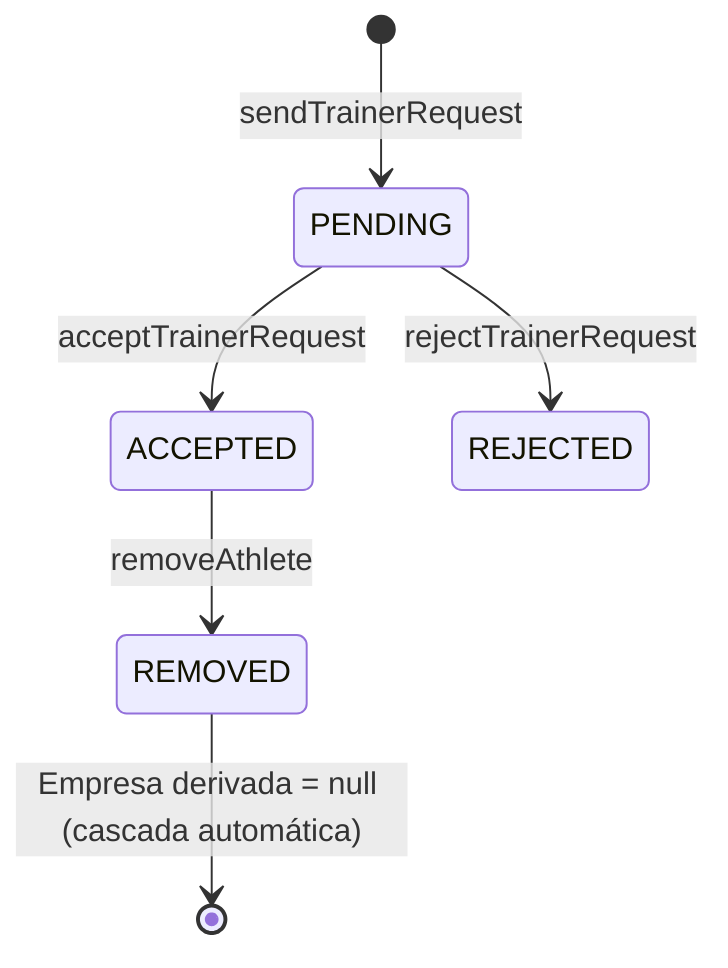

# Reglas de Negocio — Expert Sports Planner

Este documento describe, a nivel de arquitectura de software, las reglas de negocio que gobiernan el sistema de roles, la vinculación entrenador-atleta, la gestión de perfiles/permisos y los flujos de seguridad y retención de datos en **Expert Sports Planner**.

> Fuente principal del análisis: [src/types/index.ts](../src/types/index.ts), [src/utils/auth.ts](../src/utils/auth.ts), [src/context/AuthContext.tsx](../src/context/AuthContext.tsx), [src/context/MockDatabase.tsx](../src/context/MockDatabase.tsx), [src/components/CoachDashboard.tsx](../src/components/CoachDashboard.tsx) y [src/components/athlete/AthleteTabs.tsx](../src/components/athlete/AthleteTabs.tsx).

---

## 📑 Índice

1. [Sistema de Roles (RBAC)](#1-sistema-de-roles-rbac)
2. [Jerarquía y Vinculación Entrenador–Atleta](#2-jerarquía-y-vinculación-entrenador–atleta)
3. [Gestión de Perfiles y Permisos](#3-gestión-de-perfiles-y-permisos)
4. [Seguridad y Retención de Datos](#4-seguridad-y-retención-de-datos)
5. [Resumen de Matriz de Permisos](#5-resumen-de-matriz-de-permisos)

---

## 1. Sistema de Roles (RBAC)

El sistema define tres roles mutuamente excluyentes en [`Role`](../src/types/index.ts):

```typescript
export type Role = "TRAINER" | "ATHLETE" | "ADMIN";
```

Y su contraparte en tiempo de ejecución en [`ROLES`](../src/utils/auth.ts):

```typescript
export const ROLES = {
  TRAINER: "TRAINER",
  ATHLETE: "ATHLETE",
  ADMIN: "ADMIN",
} as const;
```

La comprobación de rol efectivo se centraliza en [`AuthContext`](../src/context/AuthContext.tsx), que expone helpers booleanos (`isTrainer()`, `isAthlete()`, `isAdmin()`) usados para decidir qué dashboard y qué acciones se renderizan (`App.tsx` enruta a `CoachDashboard`, `AthleteDashboard` o `AdminDashboard` según el resultado).

### 1.1 `TRAINER` (Entrenador)

- Es la entidad "propietaria" de la relación comercial: se registra con un `trainerId` único (`crypto.randomUUID()`), que actúa como identificador de vinculación para sus atletas.
- Gestiona su propia cartera de atletas, agenda de citas, biblioteca de ejercicios/equipamiento y planes de entrenamiento.
- Tiene límites de uso derivados de su plan de suscripción (`FREE`, `BASIC`, `PRO`, `GYM`), definidos en `PLAN_LIMITS`:

| Plan    | Máx. Atletas | Máx. Planes Activos | Días de prueba | Máx. Entrenadores (sub-cuentas) |
| ------- | ------------ | ------------------- | -------------- | ------------------------------- |
| `FREE`  | 3            | 2                   | 14             | —                               |
| `BASIC` | 15           | Ilimitado           | 0              | —                               |
| `PRO`   | 50           | Ilimitado           | 0              | —                               |
| `GYM`   | Ilimitado    | Ilimitado           | 0              | 5                               |

- Es el **único** rol autorizado para escribir información clínica/estructural sensible del atleta (ver [sección 3](#3-gestión-de-perfiles-y-permisos)).
- Puede pertenecer a una empresa/gimnasio (`companyId`, `companyName`, etc.), datos que se propagan automáticamente a sus atletas vinculados.

### 1.2 `ATHLETE` (Atleta)

- Depende de un entrenador: nace con `trainerId: null` y sólo adquiere un valor de `trainerId` cuando una solicitud de vinculación es aceptada (ver [sección 2](#2-jerarquía-y-vinculación-entrenador–atleta)).
- Accede en modo lectura a los planes, citas y recursos que le asigna su entrenador.
- Gestiona de forma autónoma únicamente los campos de su perfil personal considerados "no clínicos" (contacto, preferencias, notas médicas subjetivas). No puede editar datos estructurales (`basicInfo`) ni el historial de lesiones (`injuries`).
- Nunca tiene una empresa/gimnasio propios: el campo de empresa se **deriva en vivo** del entrenador vinculado y desaparece si se desvincula.

### 1.3 `ADMIN` (Administrador)

- Rol transversal de soporte/plataforma, fuera de la relación comercial entrenador-atleta.
- Gestiona usuarios, base de datos global de ejercicios, analíticas y configuración del sistema (`AdminDashboard`).
- Puede existir un administrador "super" (`isSuper: true`) que está protegido contra eliminación (ver [sección 4.3](#43-eliminación-de-cuenta)).

---

## 2. Jerarquía y Vinculación Entrenador–Atleta

### 2.1 Modelo de datos

La vinculación **no** se modela como una tabla intermedia persistente de "membresía de empresa", sino mediante dos mecanismos combinados:

1. **Vinculación directa atleta → entrenador**, vía el campo `trainerId` en el propio usuario atleta ([`User`](../src/types/index.ts)):

   ```typescript
   export interface User {
     trainerId: string | null; // El atleta almacena el trainerId del entrenador vinculado
     companyId?: string | null;
     companyName?: string | null;
     companyLegalId?: string | null;
     companyPhone?: string | null;
     companyAddress?: string | null;
   }
   ```

2. **Solicitudes de vinculación con estado**, gestionadas en [`MockDatabase.tsx`](../src/context/MockDatabase.tsx) mediante un registro `AthleteRequest` con máquina de estados: `PENDING → ACCEPTED | REJECTED → REMOVED`.

### 2.2 Flujo de vinculación

1. **`sendTrainerRequest(athleteId, trainerId, message)`**: crea una solicitud `PENDING`. Se valida que el atleta tenga credenciales completas (email/hash) y que no exista ya una solicitud `PENDING` o `ACCEPTED` previa entre ambos.
2. **`acceptTrainerRequest(requestId)`**: el entrenador acepta; la solicitud pasa a `ACCEPTED` y se registra `acceptedAt`. En este punto el atleta queda vinculado (su `trainerId` apunta al entrenador).
3. **`rejectTrainerRequest(requestId)`**: el entrenador rechaza; la solicitud pasa a `REJECTED`.

### 2.3 Regla de desvinculación en cascada

> **Regla de negocio:** si un atleta se desvincula de su entrenador (o el entrenador lo remueve), el atleta pierde automáticamente su asociación con la empresa/gimnasio del entrenador. No existe una operación separada de "salida de empresa": es una **consecuencia derivada**, no un paso manual adicional.

**Desvinculación (`removeAthlete(trainerId, athleteId)`)**: marca la solicitud `ACCEPTED` como `REMOVED` (con `removedAt`). Invocada desde `CoachDashboard.handleRemoveAthlete`.

**Por qué la cascada es automática y no requiere lógica adicional**: los campos de empresa **no se persisten nunca en el registro del atleta**. Tal como documenta el propio código fuente en [`types/index.ts`](../src/types/index.ts):

> _"Empresa a la que pertenece el entrenador (los atletas heredan esta asociación mientras estén vinculados a ese entrenador; no se persiste en el atleta, se deriva en vivo del entrenador vinculado — así la desvinculación 'cascada' ocurre automáticamente sin lógica extra)."_

En la práctica, componentes como [`AthleteTabs`](../src/components/athlete/AthleteTabs.tsx) calculan la empresa del atleta en tiempo real:

```typescript
const trainerCompanyName = useMemo(() => {
  if (!myTrainer) return null;
  const liveTrainer = getAllUsers().find((u) => u.id === myTrainer.id);
  return liveTrainer?.companyName || null;
}, [myTrainer]);
```

Si `myTrainer` deja de resolverse (porque la solicitud pasó a `REMOVED` y el atleta ya no tiene un entrenador `ACCEPTED`), `trainerCompanyName` se vuelve `null` de forma inmediata, sin necesidad de un paso de "limpieza" de datos de empresa en el atleta.

**Diagrama del flujo:**



---

## 3. Gestión de Perfiles y Permisos

El perfil del atleta se divide en bloques con propietarios de escritura estrictamente diferenciados. Esta separación está reforzada a nivel de funciones dedicadas en [`src/utils/auth.ts`](../src/utils/auth.ts), en vez de un único `updateUserProfile` genérico.

### 3.1 Datos Básicos (`basicInfo`)

- **Campo:** `AthleteBasicInfo` (`birthDate`, `weightKg`, `heightCm`, `sport`).
- **Quién crea/edita:** **Únicamente el `TRAINER`**, desde la pestaña "Mis Atletas" en `CoachDashboard`.
- **Función dedicada:** `updateAthleteBasicInfo(athleteId, basicInfo)`.
- **Justificación en código:** la función vive deliberadamente **fuera** de `updateUserProfile()` — comentario explícito: _"SOLO el Entrenador puede crear/editar esto, por eso vive fuera de updateUserProfile"_.
- **Atleta:** solo lectura (visualiza sus propios datos, no puede modificarlos).

### 3.2 Contacto de Emergencia (`emergencyContact`)

- **Campo:** `EmergencyContact` (`name`, `phone`, `relationship?`).
- **Quién crea/edita:** el **propio `ATHLETE`**, sobre sí mismo, desde la pestaña "Perfil" en [`AthleteTabs`](../src/components/athlete/AthleteTabs.tsx) (estado `editingEmergency`).
- **Función utilizada:** `updateUserProfile(userId, { emergencyContact })` (genérica de autogestión).
- **Visibilidad:** el entrenador puede **visualizar** el contacto de emergencia de sus atletas (información operativa necesaria en caso de incidente durante una sesión), pero no dispone de una función de edición sobre este campo — la escritura es exclusiva del atleta.

### 3.3 Historial Médico — Diferenciación Estricta

Este es el punto de mayor sensibilidad del modelo de permisos y está **intencionalmente partido en dos entidades con dueños distintos**:

| Sub-entidad                               | Campo                          | Propietario de escritura    | Función                                       |
| ----------------------------------------- | ------------------------------ | --------------------------- | --------------------------------------------- |
| Notas médicas subjetivas                  | `medicalNotes: string \| null` | **`ATHLETE`** (autogestión) | `updateUserProfile(userId, { medicalNotes })` |
| Lesiones (historial clínico estructurado) | `injuries: Injury[]`           | **`TRAINER`** (exclusivo)   | `setAthleteInjuries(athleteId, injuries)`     |

```typescript
export interface Injury {
  id: string;
  description: string;
  date: string;
  status: "ACTIVE" | "RECOVERED";
}
```

- **`medicalNotes`**: pensado como texto libre que el propio atleta reporta (alergias, condiciones autoinformadas, observaciones). El atleta tiene control total de edición desde su "Perfil".
- **`injuries`**: pensado como el registro clínico/estructural gestionado por el profesional. La función `setAthleteInjuries` incluye el comentario explícito: _"estrictamente solo lectura para el Atleta; únicamente el Entrenador puede agregar/modificar"_. Se edita desde `CoachDashboard` → "Mis Atletas" (estado `injuriesDraft`, con alta/edición/baja de entradas de lesión antes de persistir).
- **Regla de negocio:** el atleta **nunca** debe poder crear, editar ni eliminar entradas de `injuries` — esto evita que un atleta "autodiagnostique" o manipule su propio historial clínico gestionado por el entrenador, preservando la trazabilidad profesional del seguimiento de lesiones.

### 3.4 Otros campos de autogestión del atleta

Además de emergencia y notas médicas, el atleta gestiona vía `updateUserProfile()`:

- `email`, `phone` (datos de contacto personal).
- `notificationPrefs` (preferencias de notificaciones).

---

## 4. Seguridad y Retención de Datos

### 4.1 Cambio de Contraseña

**Función:** `changePassword(userId, currentPassword, newPassword)` en [`src/utils/auth.ts`](../src/utils/auth.ts).

Flujo obligatorio:

1. Se recupera el usuario y se verifica que exista.
2. Se recalcula el hash SHA-256 de la contraseña actual ingresada y se compara contra `user.passwordHash`. Si no coincide → error `"La contraseña actual no es correcta"`.
3. Solo si la verificación es exitosa, se genera el hash de la nueva contraseña y se persiste.
4. Si el usuario editado es el usuario autenticado actual, se actualiza también la sesión activa (`setCurrentUser`).

**Validaciones de UI** (`AthleteTabs.handleChangePassword`): la nueva contraseña debe tener al menos 6 caracteres y coincidir con su confirmación antes de habilitar el botón de guardado (`canSavePassword`).

El hashing se realiza con `crypto.subtle` (Web Crypto API), y el propio código exige un contexto seguro (HTTPS o `localhost`); de lo contrario lanza un error explícito en vez de degradar la seguridad.

### 4.2 Exportación de Datos

**Función:** `exportUserData(userId)` en [`src/utils/auth.ts`](../src/utils/auth.ts).

- Devuelve un objeto `{ exportedAt, profile }` con **todos** los campos del perfil del usuario.
- **Regla crítica:** el campo `passwordHash` se excluye explícitamente del export (`const { passwordHash: _passwordHash, ...safeUser } = user;`) — el comentario en código es explícito: _"Nunca incluir el hash de contraseña en el export."_
- **Flujo de UI** (`AthleteTabs.handleExportData`): genera un `Blob` JSON (`JSON.stringify(data, null, 2)`) y dispara una descarga automática del archivo con nombre `export-{nombreUsuario}-{timestamp}.json`.

### 4.3 Eliminación de Cuenta

**Funciones:** `deleteAccount(userId)` → `deleteUser(userId)` en [`src/utils/auth.ts`](../src/utils/auth.ts).

Reglas obligatorias:

1. **Protección del super administrador:** si el usuario a eliminar tiene `isSuper: true`, la operación lanza `"No se puede eliminar al super administrador"` y se aborta — invariante de seguridad del sistema.
2. **Confirmación explícita por texto:** en la UI (`AthleteTabs.handleDeleteAccount`), el usuario debe escribir literalmente `"ELIMINAR"` en un campo de confirmación (`deleteConfirmText === "ELIMINAR"`) antes de que el botón de borrado quede habilitado. No existe una ruta alternativa que omita este paso.
3. **Efecto de la eliminación:** se elimina el registro del usuario del almacenamiento (`saveUsers(users.filter(...))`) y se limpia la sesión activa (`setCurrentUser(null)`), forzando el retorno a la pantalla de autenticación (`onExit()`).
4. **Irreversibilidad:** no existe mecanismo de "papelera" o recuperación posterior a la eliminación; por ello se exige la confirmación textual explícita como única barrera de seguridad previa al borrado definitivo.

---

## 5. Resumen de Matriz de Permisos

| Recurso / Acción                                   | `ATHLETE`                                | `TRAINER`                        | `ADMIN`                                 |
| -------------------------------------------------- | ---------------------------------------- | -------------------------------- | --------------------------------------- |
| Ver su propio perfil                               | ✅                                       | —                                | ✅ (todos)                              |
| Editar datos básicos (`basicInfo`)                 | ❌ Solo lectura                          | ✅ (de sus atletas)              | —                                       |
| Editar contacto de emergencia                      | ✅ (propio)                              | 👁️ Solo lectura (de sus atletas) | —                                       |
| Editar notas médicas (`medicalNotes`)              | ✅ (propio)                              | 👁️ Solo lectura                  | —                                       |
| Crear/editar lesiones (`injuries`)                 | ❌ Solo lectura                          | ✅ (de sus atletas)              | —                                       |
| Enviar solicitud de vinculación                    | ✅                                       | —                                | —                                       |
| Aceptar / rechazar solicitud                       | —                                        | ✅                               | —                                       |
| Remover atleta (desvincular)                       | —                                        | ✅                               | —                                       |
| Salir de la empresa del entrenador de forma manual | ❌ (ocurre por cascada al desvincularse) | —                                | —                                       |
| Cambiar propia contraseña                          | ✅                                       | ✅                               | ✅                                      |
| Exportar propios datos                             | ✅                                       | ✅                               | ✅                                      |
| Eliminar propia cuenta                             | ✅ (con confirmación `"ELIMINAR"`)       | ✅ (con confirmación)            | ✅ (excepto super admin)                |
| Eliminar cuenta de super administrador             | ❌                                       | ❌                               | ❌ (bloqueado por invariante `isSuper`) |
| Gestión global de usuarios/ejercicios/analíticas   | —                                        | —                                | ✅                                      |

**Leyenda:** ✅ permitido · ❌ prohibido · 👁️ visibilidad de solo lectura · — no aplica al rol.
