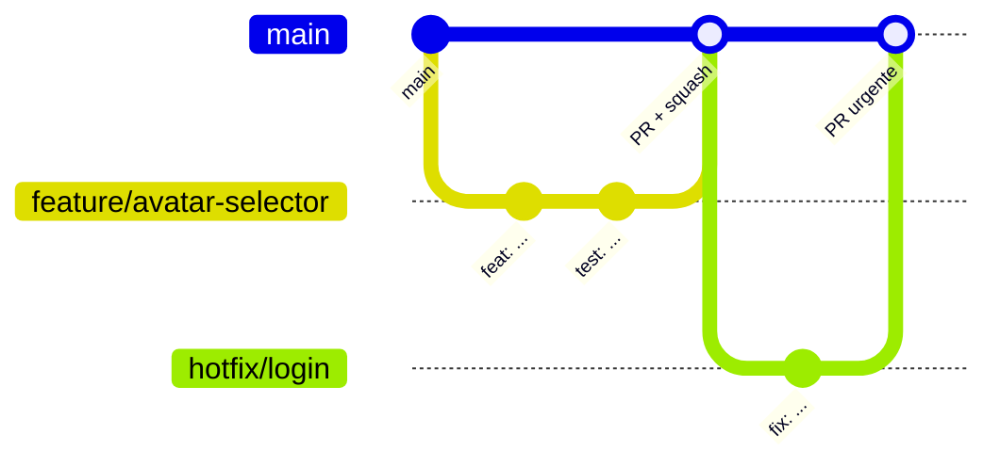

# Guía de Contribución — Expert Sports Planner

Este documento estandariza el desarrollo, el versionado y la revisión de código del proyecto. Es de cumplimiento obligatorio para todo cambio que llegue a `main`.

## Índice

1. [Requisitos del entorno](#1-requisitos-del-entorno)
2. [Convenciones de ramas](#2-convenciones-de-ramas)
3. [Convenciones de commits](#3-convenciones-de-commits)
4. [Flujo de trabajo (GitHub Flow)](#4-flujo-de-trabajo-github-flow)
5. [Estándares de código](#5-estándares-de-código)
6. [Proceso de revisión de Pull Requests](#6-proceso-de-revisión-de-pull-requests)
7. [Releases y hotfixes](#7-releases-y-hotfixes)
8. [Seguridad](#8-seguridad)

---

## 1. Requisitos del entorno

- Node.js **24.x** (campo `engines` de `package.json`) y npm.
- Copiar `.env.example` a `.env.local` y completar los valores (nunca versionarlo).
- Instalar dependencias con `npm install`.

Scripts disponibles:

| Script                                    | Uso                             |
| ----------------------------------------- | ------------------------------- |
| `npm run dev`                             | Servidor de desarrollo (Vite)   |
| `npm run lint`                            | ESLint sobre todo el proyecto   |
| `npm run format` / `npm run format:check` | Prettier (escribir / verificar) |
| `npm run test` / `npm run test:watch`     | Vitest                          |
| `npm run build`                           | Build de producción             |

---

## 2. Convenciones de ramas

`main` es la rama estable y desplegable (Vercel). **Está prohibido hacer push directo a `main`**; todo cambio entra mediante Pull Request.

Formato: `<tipo>/<descripcion-corta-en-kebab-case>`, opcionalmente con el identificador del issue: `<tipo>/<issue>-<descripcion>`.

| Prefijo     | Uso                                        | Ejemplo                           |
| ----------- | ------------------------------------------ | --------------------------------- |
| `feature/`  | Nueva funcionalidad                        | `feature/avatar-selector`         |
| `bugfix/`   | Corrección de un defecto no urgente        | `bugfix/123-toast-overlap-mobile` |
| `hotfix/`   | Corrección urgente en producción           | `hotfix/login-hash-validation`    |
| `refactor/` | Reestructuración sin cambio funcional      | `refactor/split-athlete-tabs`     |
| `chore/`    | Mantenimiento, dependencias, configuración | `chore/update-vite`               |
| `docs/`     | Solo documentación                         | `docs/business-logic`             |
| `test/`     | Añadir o corregir pruebas                  | `test/auth-password-change`       |
| `release/`  | Preparación de una versión (opcional)      | `release/1.2.0`                   |

Reglas:

- Solo minúsculas, dígitos y guiones; sin espacios, tildes ni guiones bajos.
- Máximo 50 caracteres; la descripción debe indicar el qué, no el quién.
- Una rama = un propósito. Ramas de larga duración (> 1 semana) deben sincronizarse con `main` a diario.
- Eliminar la rama tras el merge.

---

## 3. Convenciones de commits

Se utiliza [Conventional Commits 1.0](https://www.conventionalcommits.org/):

```
<tipo>(<ámbito opcional>): <descripción>

[cuerpo opcional]

[pie opcional: BREAKING CHANGE / Closes #id]
```

| Tipo       | Uso                                               |
| ---------- | ------------------------------------------------- |
| `feat`     | Nueva funcionalidad (incrementa MINOR)            |
| `fix`      | Corrección de errores (incrementa PATCH)          |
| `docs`     | Documentación                                     |
| `style`    | Formato sin cambio de lógica (Prettier, espacios) |
| `refactor` | Cambio de código sin nuevas features ni fixes     |
| `perf`     | Mejora de rendimiento                             |
| `test`     | Pruebas                                           |
| `build`    | Sistema de build o dependencias (Vite, npm)       |
| `ci`       | Integración continua / despliegue                 |
| `chore`    | Tareas de mantenimiento varias                    |
| `revert`   | Reversión de un commit previo                     |

Ámbitos sugeridos: `auth`, `admin`, `athlete`, `coach`, `plan`, `appointments`, `gym`, `ui`, `store`, `styles`, `deps`.

Reglas:

- Descripción en **imperativo**, en minúscula, sin punto final, máximo 72 caracteres.
- Idioma: español o inglés, pero consistente dentro del mismo PR.
- Cambios incompatibles: añadir `!` tras el tipo (`feat(auth)!: ...`) y un pie `BREAKING CHANGE:`.
- Referenciar issues en el pie: `Closes #42`.
- Commits atómicos: cada commit debe compilar y pasar lint/tests.

Ejemplos:

```
feat(athlete): add predefined avatar selector
fix(auth): reject password change when current password is invalid
refactor(ui): extract ConfirmDialog from AthleteTabs
chore(deps): bump vitest to 4.1
docs: add UI/UX guidelines
feat(coach)!: require trainer approval before linking athletes

BREAKING CHANGE: athletes can no longer self-link without an accepted request.
```

---

## 4. Flujo de trabajo (GitHub Flow)

Se adopta **GitHub Flow** (simple, con despliegue continuo desde `main`) en lugar de Git Flow, dado el tamaño del equipo y el despliegue continuo en Vercel.



Pasos:

1. Sincronizar: `git checkout main && git pull`.
2. Crear rama desde `main` con la convención de la sección 2.
3. Desarrollar con commits pequeños y convencionales.
4. Antes de subir, ejecutar localmente:
   ```bash
   npm run format
   npm run lint
   npm run test
   npm run build
   ```
5. Subir la rama y abrir un Pull Request hacia `main` (usar _Draft_ si aún no está listo).
6. Atender la revisión; mantener la rama actualizada con `main` (`git rebase main` o merge).
7. Merge con **Squash and merge** (el título del squash debe seguir Conventional Commits).
8. Verificar el despliegue de preview/producción y eliminar la rama.

---

## 5. Estándares de código

### 5.1 Herramientas configuradas

| Herramienta                  | Configuración                         | Notas                                                                                                              |
| ---------------------------- | ------------------------------------- | ------------------------------------------------------------------------------------------------------------------ |
| **ESLint 9** (flat config)   | `eslint.config.js`                    | `@eslint/js`, `typescript-eslint`, `eslint-plugin-react`, `react-hooks`, `react-refresh`, `eslint-config-prettier` |
| **Prettier 3**               | `.prettierrc`                         | `semi: true`, comillas dobles, `trailingComma: "all"`, `printWidth: 80`, `tabWidth: 2`                             |
| **TypeScript 5.7**           | `tsconfig.json`                       | Código nuevo en `.ts`/`.tsx`                                                                                       |
| **Vitest + Testing Library** | `vite.config.js`, `src/setupTests.ts` | Pruebas unitarias y de componentes                                                                                 |

Un PR no puede mergearse si `lint`, `format:check`, `test` o `build` fallan.

### 5.2 Reglas de React y TypeScript

- **Solo componentes funcionales** con Hooks; no crear componentes de clase.
- Respetar las reglas de Hooks (`react-hooks/rules-of-hooks` y `exhaustive-deps`); no desactivarlas sin un comentario que lo justifique.
- Componentes en `PascalCase` (`AthleteDashboard.tsx`); hooks en `camelCase` con prefijo `use` (`useModal.ts`); utilidades en `camelCase`; constantes en `UPPER_SNAKE_CASE`.
- Un componente exportado por archivo; los exports por defecto solo para componentes.
- Tipar props y datos con interfaces de `src/types`; **evitar `any` en código nuevo** (la regla está relajada solo por la migración incremental del código legado).
- Prefijar con `_` los parámetros o variables intencionalmente sin uso.
- Extraer lógica reutilizable a hooks (`src/hooks`) y estado global a stores de Zustand (`src/store`); no duplicar estado derivado.
- Acceso a datos únicamente a través de `src/services` y `src/utils`; los componentes no deben manipular `localStorage` directamente.
- Memoizar (`useMemo`, `useCallback`, `React.memo`) solo con motivo medible.
- Listas con `key` estable (nunca el índice si el orden puede cambiar).

### 5.3 UI y estilos

- Consumir los componentes de `src/components/ui` (`Button`, `Modal`, `ConfirmDialog`, `useToast`, etc.) antes de crear nuevos.
- Usar variables CSS / clases Tailwind; no hardcodear colores ni espaciados. Ver [UI_UX_GUIDELINES.md](./UI_UX_GUIDELINES.md).
- Prohibido `alert()` y `window.confirm()`; usar `Toast` y `ConfirmDialog`.
- Acciones destructivas: `ConfirmDialog` con `variant="danger"`.
- Cumplir accesibilidad: `aria-label` en controles sin texto, foco visible, objetivos táctiles ≥ 44 px.

### 5.4 Reglas de negocio

Los cambios en roles, vinculación, permisos de perfil o retención de datos deben respetar [BUSINESS_LOGIC.md](./BUSINESS_LOGIC.md) y actualizarlo si modifican una regla.

### 5.5 Pruebas

- Toda funcionalidad nueva o bug corregido debe incluir pruebas cuando sea viable (ubicadas junto al código: `*.test.ts(x)`).
- Las utilidades de seguridad/autenticación (`src/utils/auth.ts`) requieren cobertura.
- Las pruebas no deben depender del orden de ejecución ni de datos reales.

---

## 6. Proceso de revisión de Pull Requests

### 6.1 Requisitos para abrir el PR

- Título en formato Conventional Commits (será el mensaje del squash).
- Descripción con: **contexto**, **cambios realizados**, **cómo probar**, capturas/GIF para cambios visuales (claro y oscuro, móvil y escritorio) y `Closes #issue`.
- PR pequeño y enfocado (ideal < 400 líneas modificadas); dividir si es mayor.
- Autorrevisión previa del diff.
- Checklist completado:

```markdown
## Checklist

- [ ] `npm run lint` sin errores
- [ ] `npm run format:check` sin diferencias
- [ ] `npm run test` en verde
- [ ] `npm run build` exitoso
- [ ] Pruebas añadidas o actualizadas
- [ ] Documentación actualizada (docs/) si aplica
- [ ] Sin secretos, credenciales ni `console.log` residuales
- [ ] Verificado en modo claro/oscuro y en móvil (si es UI)
```

### 6.2 Reglas de revisión

- **Mínimo 1 aprobación** (2 para cambios en autenticación, permisos, persistencia o datos personales).
- El autor no aprueba su propio PR.
- Los revisores responden en un máximo de 2 días hábiles.
- Los checks automáticos (lint, formato, tests, build) deben estar en verde.
- Todas las conversaciones deben quedar resueltas antes del merge.

### 6.3 Qué debe verificar el revisor

| Área              | Criterio                                                                  |
| ----------------- | ------------------------------------------------------------------------- |
| Correctitud       | Cumple el requisito y los casos límite                                    |
| Reglas de negocio | Respeta roles y permisos (`TRAINER`/`ATHLETE`/`ADMIN`)                    |
| Seguridad         | Sin secretos, sin exposición de `passwordHash`, entrada validada, sin XSS |
| Código            | Hooks y componentes funcionales, tipado, sin duplicación                  |
| UI/UX             | Usa componentes base, accesible, responsive, tema claro/oscuro            |
| Pruebas           | Cobertura adecuada y significativa                                        |
| Rendimiento       | Sin renders o cálculos innecesarios evidentes                             |
| Documentación     | Actualizada cuando cambia comportamiento                                  |

Convención de comentarios: prefijos `blocker:` (obligatorio corregir), `suggestion:` (opcional), `question:`, `nit:` (estilo menor).

### 6.4 Merge

- Método: **Squash and merge** a `main`.
- Lo ejecuta el autor tras la aprobación y los checks en verde.
- Eliminar la rama al finalizar.

---

## 7. Releases y hotfixes

- Versionado [SemVer](https://semver.org/lang/es/) (`MAJOR.MINOR.PATCH`) deducido de los commits: `fix` → PATCH, `feat` → MINOR, `BREAKING CHANGE` → MAJOR.
- Cada release se etiqueta en `main`: `git tag v1.2.0 && git push origin v1.2.0`.
- Hotfix: rama `hotfix/...` desde `main`, PR expedito (1 aprobación y checks en verde) y tag de PATCH inmediato.
- Mantener un registro de cambios a partir de los commits convencionales.

---

## 8. Seguridad

- Nunca subir `.env*`, tokens, claves SSH ni contraseñas. Las variables `VITE_*` se incrustan en el bundle del cliente: **no colocar secretos reales en ellas** (por eso la contraseña de admin se maneja como hash).
- No guardar credenciales en archivos de notas dentro del repositorio, incluso si están ignorados por Git.
- Si se expone un secreto: revocarlo de inmediato, reemplazarlo y notificar al equipo.
- Reportar vulnerabilidades de forma privada al mantenedor, no mediante issues públicos.
