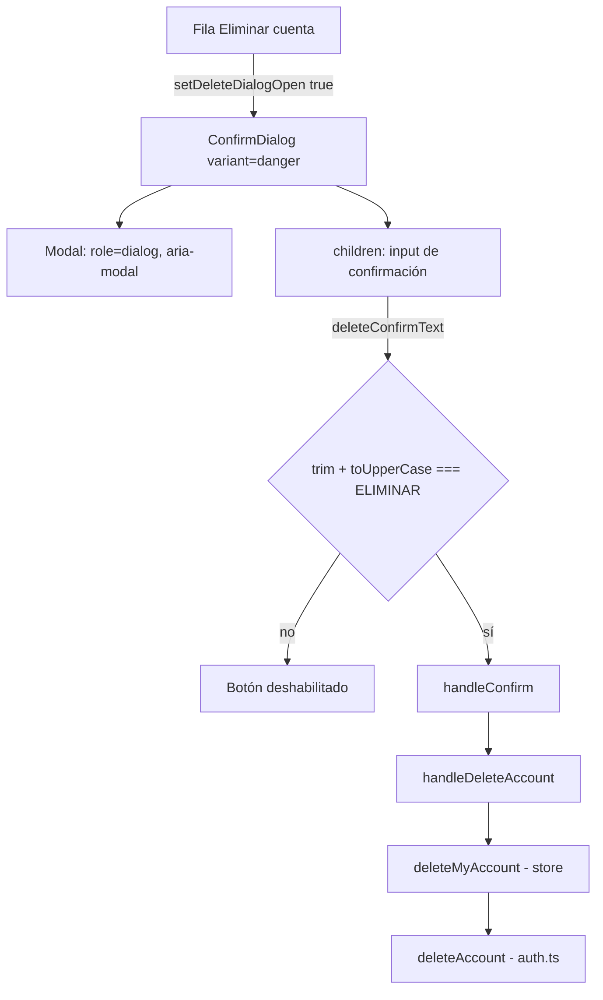
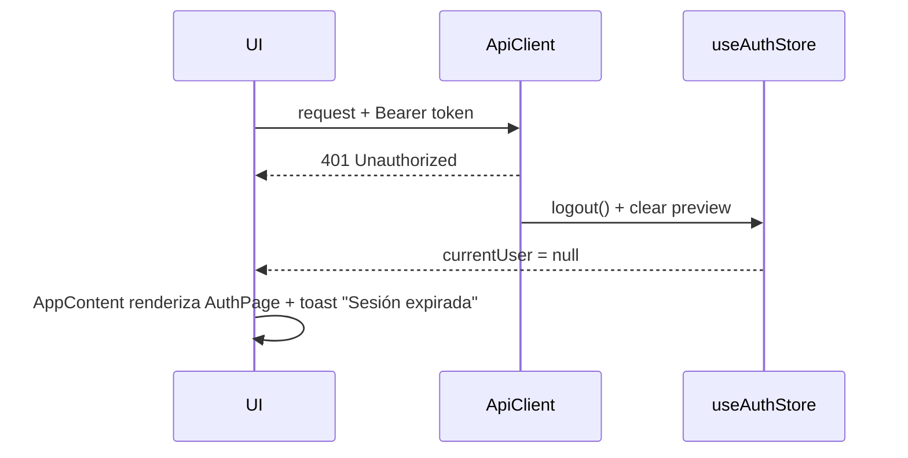

# Seguridad Frontend — Expert Sports Planner

Revisión de la configuración de rutas, autenticación, guardias por rol, validaciones destructivas y manejo de sesión.

> **Resumen ejecutivo:** la aplicación es una SPA (Vite + React) **sin router** (no hay `react-router` ni Next.js) y **sin backend**: autenticación, usuarios y datos viven en `localStorage`. Todos los controles descritos son de **experiencia de usuario, no de seguridad real**. Cualquier usuario puede modificar `localStorage` desde DevTools y saltárselos. Ver [§5](#5-riesgos-conocidos-y-hoja-de-ruta).

## Índice

1. [Rutas protegidas (Guards)](#1-rutas-protegidas-guards)
2. [Guardias por rol](#2-guardias-por-rol-role-based-routing)
3. [Validaciones de alta fricción: "Eliminar cuenta"](#3-validaciones-de-alta-fricción-eliminar-cuenta)
4. [Manejo de sesión](#4-manejo-de-sesión)
5. [Riesgos conocidos y hoja de ruta](#5-riesgos-conocidos-y-hoja-de-ruta)

---

## 1. Rutas protegidas (Guards)

### 1.1 No hay enrutador

No existe `<Route>`, `BrowserRouter` ni `ProtectedRoute` en `src/`, y `package.json` no declara un router. La URL no cambia al navegar: la "ruta" visible es estado de React (`activeTab`, en `AppContent`). Consecuencias:

- No hay URLs como `/trainer-dashboard` que bloquear ni que un atleta pueda teclear.
- No existen deep links ni historial del navegador por vista.

### 1.2 El "guard" es el render condicional de `AppContent`

El equivalente funcional de una ruta protegida está en [App.tsx](../src/App.tsx):

```tsx
// Simplificado
const { currentUser, isAuthenticated, isAdmin, isAthlete, isTrainer } =
  useAuth();

if (!isAuthenticated()) return <AuthPage />; // sin sesión → login
if (isAdmin()) return <AdminDashboard />; // lazy + Suspense
if (isAthlete()) return <AthleteDashboard />;
if (isTrainer()) return <CoachDashboard />;
```

| Paso | Comprobación                | Resultado                                                         |
| ---- | --------------------------- | ----------------------------------------------------------------- |
| 1    | `currentUser === null`      | Se muestra `AuthPage` (login/registro); ningún dashboard se monta |
| 2    | `role` del usuario efectivo | Se monta solo el dashboard del rol                                |

Detalles relevantes:

- `useAuth()` lanza un error si se usa fuera de `AuthProvider`, evitando consumir un contexto vacío.
- `BottomNav` solo se renderiza con `currentUser` y fuera del rol `ADMIN`.
- Un `useEffect` restablece `activeTab` al cambiar de rol, para no arrastrar una pestaña inexistente al otro dashboard.
- Como los dashboards son hijos exclusivos de la rama del rol, **no se descargan ni ejecutan** para otros roles (el de admin se carga con `lazy`).

---

## 2. Guardias por rol (Role-Based Routing)

### 2.1 Modelo de roles

`ROLES` en [utils/auth.ts](../src/utils/auth.ts): `"TRAINER" | "ATHLETE" | "ADMIN"`. Los helpers `isTrainer()`, `isAthlete()`, `isAdmin()` de `useAuth()` comparan contra el rol del **usuario efectivo** (`previewUser || currentUser`).

### 2.2 Cómo se bloquea el acceso cruzado

No se "bloquea una ruta": el dashboard de otro rol **nunca se monta**. Un `ATHLETE` no puede llegar a `CoachDashboard` porque `isTrainer()` es falso y no hay URL ni pestaña que lo lleve ahí.

| Usuario   | Vista resultante                | Vistas inaccesibles desde la UI                        |
| --------- | ------------------------------- | ------------------------------------------------------ |
| `ATHLETE` | `AthleteDashboard`              | `CoachDashboard`, `AdminDashboard`                     |
| `TRAINER` | `CoachDashboard` + `DemoBanner` | `AthleteDashboard`, `AdminDashboard`                   |
| `ADMIN`   | `AdminDashboard` (sin `Layout`) | Dashboards de atleta/entrenador, salvo en vista previa |

### 2.3 Vista previa (impersonación del admin)

- `startPreview()` de `AuthContext` solo actúa si `realUser.role === ADMIN`; en caso contrario no hace nada.
- El usuario simulado es solo memoria (`usePreviewStore`); no cambia `localStorage["currentUser"]`.
- `logout` limpia la vista previa, y `handleExit` sale de la vista previa antes que cerrar sesión.
- Se muestra un banner persistente ("Vista previa (demo) como …") con botón de retorno.

### 2.4 Protecciones a nivel de función

| Función (`utils/auth.ts`) | Protección                                                                      |
| ------------------------- | ------------------------------------------------------------------------------- |
| `deleteUser`              | Lanza error si el usuario es `isSuper`                                          |
| `changePassword`          | Exige la contraseña actual                                                      |
| `exportUserData`          | Excluye el hash de contraseña                                                   |
| `quickAdminLogin` (store) | Rechazado si `!import.meta.env.DEV`                                             |
| `initializeSuperAdmin`    | Requiere `VITE_ADMIN_EMAIL` y `VITE_ADMIN_PASSWORD_HASH`; lanza error si faltan |

**Límite:** funciones trainer-only como `setAthleteInjuries` o `updateAthleteBasicInfo` **no verifican el rol del llamador**; dependen de que solo `CoachDashboard` las invoque.

---

## 3. Validaciones de alta fricción: "Eliminar cuenta"

Implementación en [AthleteTabs.tsx](../src/components/athlete/AthleteTabs.tsx) (pestaña Perfil) sobre [ConfirmDialog.tsx](../src/components/ui/ConfirmDialog.tsx), que a su vez extiende `Modal`.

### 3.1 Capas



### 3.2 Estado (local, no global)

```tsx
const [deleteDialogOpen, setDeleteDialogOpen] = useState(false);
const [deleteConfirmText, setDeleteConfirmText] = useState("");
const [deleting, setDeleting] = useState(false);
```

### 3.3 Mecanismo de habilitación

```tsx
<ConfirmDialog
  isOpen={deleteDialogOpen}
  onClose={() => {
    setDeleteDialogOpen(false);
    setDeleteConfirmText("");
  }}
  onConfirm={handleDeleteAccount}
  variant="danger"
  confirmText="Eliminar mi cuenta"
  isLoading={deleting}
  confirmDisabled={deleteConfirmText.trim().toUpperCase() !== "ELIMINAR"}
>
  <input
    value={deleteConfirmText}
    onChange={(e) => setDeleteConfirmText(e.target.value)}
  />
</ConfirmDialog>
```

- El `input` es **controlado**; `confirmDisabled` se recalcula en cada pulsación.
- La comparación **ignora mayúsculas/minúsculas y espacios en los extremos** (`" eliminar "` habilita el botón). No es coincidencia exacta estricta.
- `ConfirmDialog` deshabilita el botón con `disabled={isLoading || confirmDisabled}`; durante `isLoading` muestra "Procesando…".
- Durante la operación se bloquean cierre por backdrop y por `Escape` (`closeOnBackdrop={!isLoading}`, `closeOnEscape={!isLoading}`), y el botón "Cancelar" queda deshabilitado.
- Al cerrar (`onClose`), el texto se borra para que la siguiente apertura empiece bloqueada.

### 3.4 Flujo de confirmación

1. `ConfirmDialog.handleConfirm` hace `await onConfirm(); onClose();`.
2. `handleDeleteAccount`: `setDeleting(true)` → `deleteMyAccount()` → `setDeleting(false)`.
3. Éxito: cierra el diálogo y llama a `onExit()` (logout) → `AppContent` renderiza `AuthPage`.
4. Error: toast con el mensaje (p. ej. no se puede eliminar al super administrador).
5. `deleteMyAccount` → `deleteAccount(id)` → `deleteUser` (filtra `users`) + `setCurrentUser(null)`; el store pone `currentUser = null`.

### 3.5 Accesibilidad

`Modal` expone `role="dialog"`, `aria-modal="true"`, cierre con `Escape` y bloqueo de scroll; el botón peligroso usa `variant="danger"` con icono `XCircle`.

### 3.6 Limitaciones

- `onClose()` se ejecuta tras `onConfirm()` aunque haya fallado: el diálogo se cierra y el texto se borra en caso de error.
- La eliminación solo borra el registro en `users` y la sesión; **no limpia** datos asociados (planes en `expert_planner_clients`, reservas, citas, solicitudes).
- No pide contraseña (re-autenticación) para una acción irreversible.
- Toda la validación es de cliente.

---

## 4. Manejo de sesión

### 4.1 No hay token

La sesión es el objeto `User` completo guardado en `localStorage["currentUser"]`. **No existe JWT, cookie, refresh token ni expiración de sesión**, por lo que **no hay flujo de logout automático por expiración de token**. (`ApiClient` en `services/dataServices.ts` prepara `Authorization: Bearer ${session.token}`, pero no se usa y `USE_MOCK` está en `true`.)

### 4.2 Qué ocurre hoy

| Evento                         | Comportamiento                                                                                            |
| ------------------------------ | --------------------------------------------------------------------------------------------------------- |
| Recarga / cierre del navegador | La sesión persiste (`useAuthStore` se inicializa con `getCurrentUser()`)                                  |
| Logout manual                  | `logoutUser()` → `setCurrentUser(null)`; el store vacía `currentUser`; se limpia la vista previa          |
| Login/logout en otra pestaña   | Evento `storage` → `syncFromStorage()` actualiza el store                                                 |
| Eliminación de cuenta          | Sesión eliminada, vuelve a `AuthPage`                                                                     |
| Trial vencido                  | `loginUser` marca `subscription.status = EXPIRED` en el login; se muestra `DemoBanner` (no cierra sesión) |

La expiración del **trial** afecta funciones (`hasFeatureAccess`, límites de plan), no la sesión.

### 4.3 Diseño recomendado para expiración de token (al integrar backend)



- Interceptar `401` en `ApiClient.request` y llamar `useAuthStore.getState().logout()`; `AppContent` ya reacciona a `currentUser === null`.
- Guardar `expiresAt` y validar al montar y en `visibilitychange`; programar un `setTimeout` hasta el vencimiento.
- Preferir cookies `HttpOnly; Secure; SameSite` para el token y evitar `localStorage`.

---

## 5. Riesgos conocidos y hoja de ruta

| #   | Riesgo                                          | Severidad | Detalle                                                                                              | Mitigación                                                    |
| --- | ----------------------------------------------- | --------- | ---------------------------------------------------------------------------------------------------- | ------------------------------------------------------------- |
| 1   | Autorización solo en cliente                    | Crítica   | Editar `currentUser.role` en `localStorage` permite ver otro dashboard                               | Autorización en servidor; nunca confiar en el rol del cliente |
| 2   | Sesión sin expiración                           | Alta      | Persiste indefinidamente                                                                             | Tokens con TTL y logout por `401`                             |
| 3   | Hash SHA-256 sin sal                            | Alta      | `hashPassword` (Web Crypto) es vulnerable a rainbow tables; el código lo indica ("no es producción") | bcrypt/argon2 en servidor                                     |
| 4   | Hashes y usuarios en `localStorage`             | Alta      | Visibles y exfiltrables por XSS o acceso al equipo                                                   | Datos de usuarios solo en backend                             |
| 5   | Login sin contraseña por nombre                 | Media     | `loginUser` permite entrar a usuarios sin `passwordHash` con solo su nombre                          | Eliminar ese camino al salir de demo                          |
| 6   | Funciones trainer-only sin verificar rol        | Media     | `setAthleteInjuries`, `updateAthleteBasicInfo`                                                       | Validar rol y vínculo entrenador–atleta                       |
| 7   | Hash de admin en variables `VITE_*`             | Media     | Todo `VITE_*` se incluye en el bundle público                                                        | Mover al backend                                              |
| 8   | Sin rate limiting ni bloqueo de intentos        | Media     | Fuerza bruta local trivial                                                                           | Límite de intentos en servidor                                |
| 9   | Eliminar cuenta sin cascada ni re-autenticación | Media     | Datos huérfanos                                                                                      | Borrado en cascada + pedir contraseña                         |
| 10  | Sin cabeceras de seguridad (CSP, etc.)          | Media     | `vercel.json` solo define `installCommand`                                                           | Añadir CSP, `X-Frame-Options`, `Referrer-Policy`              |
| 11  | Sin router                                      | Info      | Sin deep links ni guardias de URL                                                                    | Adoptar `react-router` con `ProtectedRoute`/`RoleRoute`       |

### 5.1 Patrón sugerido al adoptar un router

```tsx
function RoleRoute({
  allow,
  children,
}: {
  allow: Role[];
  children: JSX.Element;
}) {
  const { currentUser } = useAuth();
  const location = useLocation();
  if (!currentUser)
    return <Navigate to="/login" state={{ from: location }} replace />;
  if (!allow.includes(currentUser.role)) return <Navigate to="/" replace />;
  return children;
}

<Route
  path="/trainer-dashboard"
  element={
    <RoleRoute allow={["TRAINER"]}>
      <CoachDashboard />
    </RoleRoute>
  }
/>;
```

Este guard mejora la UX, pero la protección efectiva debe estar en las respuestas del backend (403 en recursos ajenos).

### 5.2 Checklist previo a producción

- [ ] Backend con autenticación y autorización por rol/recurso.
- [ ] Tokens con expiración y manejo de `401` global.
- [ ] Hash de contraseñas en servidor (argon2/bcrypt).
- [ ] Eliminar login por nombre y `quickAdminLogin`; quitar credenciales admin de `VITE_*`.
- [ ] Cabeceras de seguridad y CSP en `vercel.json`.
- [ ] Borrado de cuenta con cascada y re-autenticación.
- [ ] Revocar el token de GitHub guardado en texto plano en `gitNotes.txt`.
