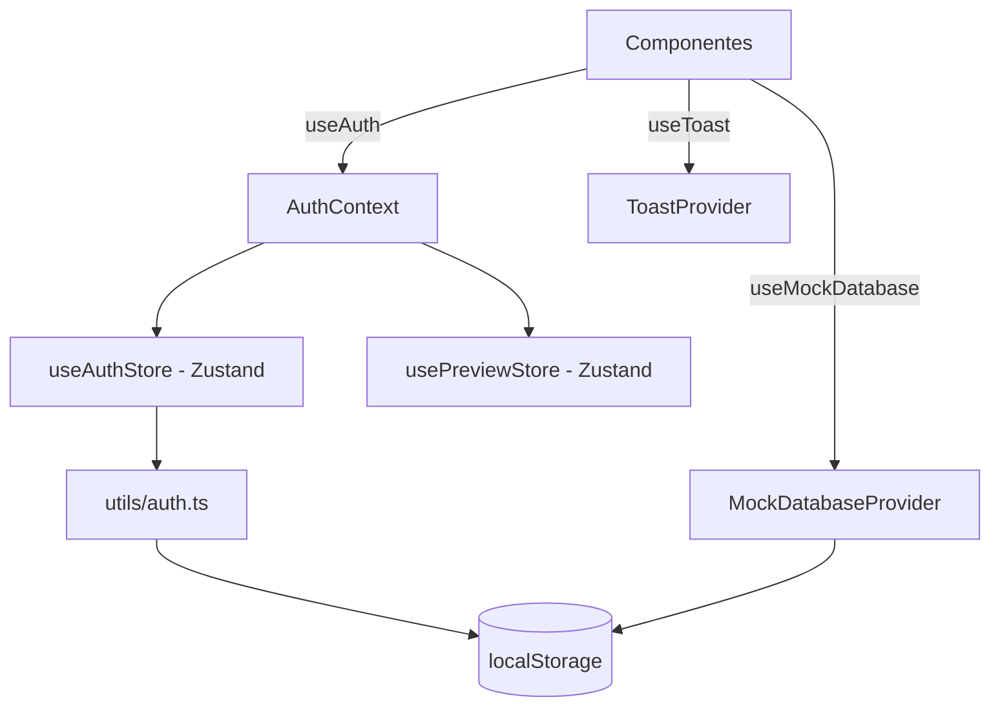

# Gestión de Estado — Expert Sports Planner

Este documento describe cómo se gestiona el estado global y local, dónde vive la sesión, cómo se renderizan vistas según el rol y qué se persiste en el navegador.

## Índice

1. [Enfoque y librerías](#1-enfoque-y-librerías)
2. [Estado del usuario (`currentUser`)](#2-estado-del-usuario-currentuser)
3. [Estados de UI](#3-estados-de-ui)
4. [Persistencia](#4-persistencia)
5. [Reglas y recomendaciones](#5-reglas-y-recomendaciones)

---

## 1. Enfoque y librerías

No se usa Redux. El estado se reparte en cuatro mecanismos, cada uno con una responsabilidad distinta:

| Mecanismo                                | Archivo                                                     | Qué gestiona                                                                      |
| ---------------------------------------- | ----------------------------------------------------------- | --------------------------------------------------------------------------------- |
| **Zustand** (`useAuthStore`)             | [store/useAuthStore.ts](../src/store/useAuthStore.ts)       | Sesión: `currentUser`, `loading`, `error` y acciones de autenticación/perfil      |
| **Zustand** (`usePreviewStore`)          | [store/usePreviewStore.ts](../src/store/usePreviewStore.ts) | Vista previa (impersonación) del super admin                                      |
| **Context API** (`AuthContext`)          | [context/AuthContext.tsx](../src/context/AuthContext.tsx)   | Fachada de `useAuth()`: combina ambos stores y expone helpers de rol              |
| **Context API** (`MockDatabaseProvider`) | [context/MockDatabase.tsx](../src/context/MockDatabase.tsx) | Datos de dominio: clientes/planes, reservas, citas, solicitudes atleta–entrenador |
| **Context API** (`ToastProvider`)        | [components/ui/Toast.tsx](../src/components/ui/Toast.tsx)   | Cola de notificaciones (toasts)                                                   |
| **`useState` local**                     | Componentes                                                 | Estado de UI efímero (modales, formularios, pestañas)                             |

### 1.1 Por qué este enfoque

- **Zustand para la sesión:** el comentario de `useAuthStore` indica que el estado de auth **se extrajo de `AuthContext`** para evitar el re-render en cascada que producía el Context al cambiar `loading`/`error`, y para poder accederlo fuera de componentes. Los componentes suscritos usan selectores (`useAuthStore((s) => s.currentUser)`) y solo se renderizan cuando cambia esa porción.
- **`usePreviewStore` separado:** se extrajo de `AuthContext` por responsabilidad única, para que los consumidores de auth no se re-rendericen por cambios de preview.
- **Context para dominio y toasts:** son árboles de datos que se consumen de forma amplia y cambian con poca frecuencia de "forma"; el Context evita añadir más stores mientras los datos viven en `localStorage` (modo mock).
- **`AuthContext` como fachada:** mantiene la API histórica `useAuth()` para no reescribir los componentes al migrar a Zustand.

### 1.2 Árbol de proveedores

Definido en [App.tsx](../src/App.tsx):

```tsx
<AuthProvider>
  {" "}
  {/* fachada sobre useAuthStore + usePreviewStore */}
  <MockDatabaseProvider>
    {" "}
    {/* datos de dominio (localStorage) */}
    <ToastProvider>
      {" "}
      {/* notificaciones */}
      <AppContent />
    </ToastProvider>
  </MockDatabaseProvider>
</AuthProvider>
```



---

## 2. Estado del usuario (`currentUser`)

### 2.1 Dónde vive

| Nivel                                   | Ubicación                     | Detalle                                                               |
| --------------------------------------- | ----------------------------- | --------------------------------------------------------------------- |
| Memoria (fuente de verdad en ejecución) | `useAuthStore.currentUser`    | Inicializado con `getCurrentUser()` al cargar el módulo               |
| Persistencia                            | `localStorage["currentUser"]` | Escrito por `setCurrentUser` en [utils/auth.ts](../src/utils/auth.ts) |
| Registro de usuarios                    | `localStorage["users"]`       | Lista completa; `getAllUsers()` la lee                                |
| Usuario "efectivo"                      | `AuthContext`                 | `previewUser \|\| currentUser`                                        |

El modelo `User` ([types/index.ts](../src/types/index.ts)) contiene, entre otros: `id`, `role` (`"TRAINER" \| "ATHLETE" \| "ADMIN"`), `trainerId`, `avatarId`, `emergencyContact`, `medicalNotes`, `injuries`, `basicInfo`, `notificationPrefs` y datos de empresa.

### 2.2 Ciclo de vida de la sesión

| Acción (store)                                       | Efecto                                                                                       |
| ---------------------------------------------------- | -------------------------------------------------------------------------------------------- |
| `login` / `register`                                 | Llama a `loginUser`/`registerUser`, ejecuta `setCurrentUser(user)` y actualiza `currentUser` |
| `logout`                                             | `logoutUser()` + `currentUser = null` (y `clearPreview()` desde `AuthContext`)               |
| `updateProfile`, `changeUserPassword`, `upgradePlan` | Persisten vía `auth.ts` y reemplazan `currentUser` con el usuario actualizado                |
| `deleteMyAccount`                                    | Elimina el usuario y deja `currentUser = null`                                               |
| `syncFromStorage`                                    | Relee `localStorage`; se dispara con el evento `storage` (sincroniza otras pestañas)         |
| `quickAdminLogin`                                    | Solo si `import.meta.env.DEV`                                                                |

Las acciones devuelven `{ success, error? }` en lugar de lanzar, y fijan `loading`/`error` en el store.

### 2.3 Cómo acceden los componentes

Se consume con `useAuth()` ([AuthContext.tsx](../src/context/AuthContext.tsx)):

| Campo / helper                                                       | Descripción                                             |
| -------------------------------------------------------------------- | ------------------------------------------------------- |
| `currentUser`                                                        | Usuario **efectivo** (el simulado si hay vista previa)  |
| `realUser`                                                           | Usuario real autenticado                                |
| `isAuthenticated()`                                                  | `currentUser !== null`                                  |
| `isTrainer()`, `isAthlete()`, `isAdmin()`                            | Comparan `effectiveUser.role` con `ROLES`               |
| `getTrainerId()`                                                     | Entrenador: `trainerId \|\| id`; atleta: su `trainerId` |
| `hasFeatureAccess(f)`, `getUserLimits(a, p)`, `trialDaysRemaining()` | Plan de suscripción                                     |
| `isPreviewMode()`, `startPreview()`, `stopPreview()`                 | Vista previa (solo `ADMIN` puede iniciarla)             |

### 2.4 Renderizado condicional por rol

El control de acceso se hace **por enrutamiento de vistas**, no con `if` dispersos dentro de cada botón. En [App.tsx](../src/App.tsx):

```tsx
if (isAdmin()) return <AdminDashboard />;
if (isAthlete()) return <AthleteDashboard />;
if (isTrainer()) return <CoachDashboard />;
```

Ejemplo — **lesiones** (regla: solo el Entrenador las crea/edita):

| Rol       | Vista                                                               | Comportamiento                                                                                                           |
| --------- | ------------------------------------------------------------------- | ------------------------------------------------------------------------------------------------------------------------ |
| `ATHLETE` | `AthleteTabs` → "Perfil" → "Lesiones"                               | Solo lectura: se listan `currentUser.injuries` o "Sin lesiones registradas"; **no hay controles de edición** en el árbol |
| `TRAINER` | `CoachDashboard` → "Mis Atletas" → modal "Datos Básicos y Lesiones" | Edita `injuriesDraft` y guarda con `setAthleteInjuries`                                                                  |

Es decir, los botones de edición de lesiones no se ocultan con un condicional: simplemente **pertenecen a un componente que solo se monta para `TRAINER`**. Si se necesita reutilizar un componente entre roles, condicionar con el helper:

```tsx
const { isTrainer } = useAuth();
{
  isTrainer() && <Button onClick={openInjuriesEditor}>Editar lesiones</Button>;
}
```

Otros puntos de renderizado por rol:

- `App.tsx`: pestañas del `BottomNav` (`TRAINER_TABS` vs. las del atleta) y validación de `activeTab` al cambiar de rol.
- `TopBar`: insignia de rol y nombre de empresa (solo panel de entrenador).
- Empresa del atleta: derivada en vivo del entrenador vinculado (no se guarda en el atleta).

> **Límite de seguridad:** al ser todo cliente, esta restricción es de interfaz. Las funciones de `auth.ts` (`setAthleteInjuries`, `updateAthleteBasicInfo`) no validan rol; la autorización real deberá hacerse en el backend (ver [API_SERVICES.md](./API_SERVICES.md)).

### 2.5 Vista previa del super admin (impersonación)

`usePreviewStore.previewUser` guarda en memoria un usuario simulado. `AuthContext` expone `currentUser = previewUser || realUser`, por lo que todos los helpers de rol reflejan el rol simulado. Las ediciones en vista previa pasan por `updateProfileForEffectiveUser`, que actualiza el registro mock en `localStorage` y luego el objeto en memoria (`updatePreviewUser`). `handleLogout` limpia la vista previa, y `handleExit` en `App.tsx` solo sale de la vista previa si está activa.

---

## 3. Estados de UI

No existe un store global de UI; se usa el mecanismo mínimo necesario.

| Estado                                         | Mecanismo                                                                               | Alcance                                           |
| ---------------------------------------------- | --------------------------------------------------------------------------------------- | ------------------------------------------------- |
| Toasts / alertas                               | `ToastProvider` + `useToast().addToast(msg, type, duration)`                            | Global (cola con autocierre, por defecto 3 s)     |
| Tema claro/oscuro                              | `useTheme` (`useState` + `localStorage`)                                                | Aplicado a `document.documentElement[data-theme]` |
| Modal "Eliminar Cuenta"                        | `useState` local en `AthleteTabs` (`deleteDialogOpen`, `deleteConfirmText`, `deleting`) | Local al componente                               |
| Modal "Quitar atleta"                          | `athleteToRemove` (`useState`) en `CoachDashboard`                                      | Local                                             |
| Selector de avatar                             | `avatarPickerOpen` (`useState`) en `AthleteTabs`                                        | Local                                             |
| Pestaña activa, `showPricing`, `hideBottomNav` | `useState` en `AppContent`                                                              | Local a `App` (pasado por props)                  |
| Carga y error de auth                          | `useAuthStore.loading` / `error`                                                        | Global                                            |
| Formularios (borradores)                       | `useState` (`injuriesDraft`, `basicInfoDraft`, etc.)                                    | Local                                             |

### 3.1 Toasts y notificaciones

- Componente `ToastProvider` mantiene `toasts` con `useState`; `addToast` genera un id, agrega el toast y lo elimina con `setTimeout` (si `duration > 0`).
- Tipos: `success`, `error`, `warning`, `info`.
- Uso típico tras una mutación:

  ```tsx
  const result = await updateProfile({ avatarId });
  addToast(
    result.success
      ? "Avatar actualizado"
      : result.error || "No se pudo guardar",
    result.success ? "success" : "error",
  );
  ```

### 3.2 Recordatorios de sesiones y citas

Son **preferencias persistidas**, no estado de UI. `NotificationPrefs` (`sessionReminders`, `appointmentReminders`, ambos `true` por defecto) vive dentro de `currentUser.notificationPrefs`. Los interruptores de "Perfil" llaman a `updateProfile({ notificationPrefs: {...} })` y cambian `currentUser` en el store.

> Hoy solo se **guardan** las preferencias; no hay un planificador que dispare recordatorios. Cuando exista, debe leerlas de `currentUser.notificationPrefs`.

### 3.3 Modal "Eliminar Cuenta"

Flujo con estado local en `AthleteTabs`:

1. La fila "Eliminar Cuenta" hace `setDeleteDialogOpen(true)`.
2. `ConfirmDialog` (`variant="danger"`) muestra el aviso y un `input`; `deleteConfirmText` controla `confirmDisabled` (se habilita al escribir "ELIMINAR", sin distinguir mayúsculas).
3. Al confirmar, `handleDeleteAccount` activa `deleting` y llama a `deleteMyAccount()` del store.
4. Éxito: el store deja `currentUser = null` y `App` renderiza `AuthPage`; error: toast.
5. Al cerrar, se limpian `deleteDialogOpen` y `deleteConfirmText`.

### 3.4 Hooks de apoyo

[`useModal`](../src/hooks/useModal.ts) (`isOpen`, `open`, `close`, `toggle`) y `useConfirm` (`confirm`, `handleConfirm`, `handleCancel`, `isLoading`) encapsulan el patrón de modales. Varios componentes aún usan `useState` directo; ambos enfoques son válidos, pero para código nuevo se recomienda el hook.

---

## 4. Persistencia

Todo se persiste en **`localStorage`**. **No se usa `sessionStorage`** (no hay coincidencias en el código).

| Clave                                                                     | Contenido                                                                    | Escrito por                                               |
| ------------------------------------------------------------------------- | ---------------------------------------------------------------------------- | --------------------------------------------------------- |
| `currentUser`                                                             | Usuario autenticado (sesión)                                                 | `setCurrentUser` en `utils/auth.ts`                       |
| `users`                                                                   | Todos los usuarios (incluye `avatarId`, `notificationPrefs`, lesiones, etc.) | `saveUsers` en `utils/auth.ts`; siembra de `MockDatabase` |
| `expert_planner_clients`                                                  | Clientes y planes                                                            | `MockDatabase`                                            |
| `expert_planner_gym_availability` / `expert_planner_gym_bookings`         | Horarios y reservas de gimnasio                                              | `MockDatabase`                                            |
| `expert_planner_appointments` / `expert_planner_appointment_availability` | Citas y disponibilidad                                                       | `MockDatabase`                                            |
| `athleteRequests`                                                         | Solicitudes atleta–entrenador (`PENDING/ACCEPTED/REJECTED/REMOVED`)          | `MockDatabase`                                            |
| `athleteRequests_cleanup_v1`                                              | Marca de limpieza única                                                      | `MockDatabase`                                            |
| `expert_planner_theme`                                                    | `"light"` o `"dark"`                                                         | `useTheme`                                                |

Utilidades: [utils/storage.ts](../src/utils/storage.ts) (`getFromStorage`, `setToStorage`, `removeFromStorage`, con `try/catch`) y el hook [`useLocalStorage`](../src/hooks/useLocalStorage.ts).

### 4.1 Mantener la sesión viva

- Al cargar la app, `useAuthStore` inicializa `currentUser` con `getCurrentUser()`; por eso la sesión **sobrevive a recargas y al cierre del navegador** (no expira, no hay token).
- El evento `storage` de `window` (`AuthContext`) llama a `syncFromStorage()` para reflejar logins/logouts hechos en **otra pestaña**.
- `logout` y `deleteAccount` ejecutan `setCurrentUser(null)`, que elimina la clave `currentUser`.
- No se usa el middleware `persist` de Zustand: la persistencia es manual mediante `auth.ts`.

### 4.2 Avatar (estilo Netflix)

- Selección: `AvatarSelector` → `handleSelectAvatar(id)` → `updateProfile({ avatarId })`.
- Se guarda **solo el identificador** (`avatarId`, p. ej. `"fox"`) dentro del usuario, en `users` y en `currentUser`. El emoji y el gradiente se resuelven en render con `getAvatarById`.
- Al cambiar, el store reemplaza `currentUser`, por lo que todos los componentes suscritos (p. ej. `AthleteDashboard`, `AthleteTabs`) se actualizan sin pasos adicionales.
- Persiste entre sesiones y recargas; se elimina junto con la cuenta.

### 4.3 Datos de demostración

`MockDatabaseProvider` **siembra en cada carga** un entrenador y dos atletas mock (upsert en `users`), además de planes, reservas y citas con fechas relativas a "hoy". Esto permite que las funciones de edición del entrenador operen sobre usuarios reales en el modo vista previa.

### 4.4 Solución de problemas

| Síntoma                           | Causa probable                                 | Solución                                                      |
| --------------------------------- | ---------------------------------------------- | ------------------------------------------------------------- |
| Los datos no persisten            | `localStorage` deshabilitado o modo privado    | Habilitar almacenamiento; revisar DevTools → Application      |
| La sesión se pierde al recargar   | Clave `currentUser` borrada o JSON corrupto    | Volver a iniciar sesión; limpiar `currentUser`                |
| Estado inconsistente tras pruebas | Datos antiguos en `users` o `expert_planner_*` | Borrar las claves de §4 (o `localStorage.clear()`) y recargar |
| Datos de un usuario anterior      | `currentUser` no sincronizado entre pestañas   | Verificar el listener `storage`; cerrar sesión en ambas       |
| "Atleta no encontrado" al editar  | El atleta no existe en `users`                 | Comprobar la siembra de `MockDatabase` y el `id`              |

Para simular otro usuario en desarrollo: iniciar sesión con otra cuenta, o usar la vista previa del super admin.

---

## 5. Reglas y recomendaciones

1. **Sesión y rol:** leerlos siempre desde `useAuth()`; no leer `localStorage` desde componentes.
2. **Selectores de Zustand:** suscribirse a la porción mínima (`useAuthStore((s) => s.currentUser)`) para limitar re-renders.
3. **Mutaciones de usuario:** pasar por las acciones del store (`updateProfile`, etc.) para que `currentUser` y `localStorage` no se desincronicen.
4. **Estado de UI efímero:** mantenerlo local (`useState`/`useModal`); elevarlo solo si varios componentes lo necesitan.
5. **Feedback:** usar `useToast` para resultados de acciones y `ConfirmDialog` para acciones destructivas.
6. **Acciones restringidas por rol:** colocarlas en vistas exclusivas del rol y, al migrar a API, validar también en el servidor.
7. **Migración a backend:** reemplazar `localStorage` por llamadas a API conservando los contratos `{ success, error }` de las acciones del store; sustituir `currentUser` persistido por un token con expiración.

### 5.1 Puntos a vigilar

| Hallazgo                                                                                                  | Impacto                                                       | Recomendación                                            |
| --------------------------------------------------------------------------------------------------------- | ------------------------------------------------------------- | -------------------------------------------------------- |
| `MockDatabase` y `AuthContext` usan `localStorage` por caminos distintos (`users` leído/escrito en ambos) | Posibles desincronizaciones                                   | Centralizar accesos en `utils/auth.ts` / `storage.ts`    |
| `useAuthStore.currentUser` se lee una sola vez al iniciar el módulo                                       | Cambios en otra pestaña solo se reflejan vía evento `storage` | Mantener el listener                                     |
| La sesión no caduca                                                                                       | Riesgo en equipos compartidos                                 | Añadir expiración al introducir token                    |
| `AuthContext` recrea el objeto `value` en cada render                                                     | Re-renders de consumidores                                    | Memoizar con `useMemo` si aparece impacto de rendimiento |
| `useLocalStorage` y `useTheme` escriben con mecanismos distintos                                          | Inconsistencia                                                | Unificar en `storage.ts`                                 |
